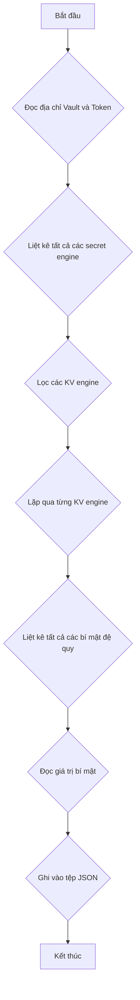

# Vault Recursive Copy

Đây là một công cụ CLI để sao chép đệ quy các bí mật từ một Vault instance sang một tệp JSON.

## Lưu đồ



## Build

Để build ứng dụng, bạn cần cài đặt Go. Sau đó, bạn có thể chạy lệnh sau:

```bash
go build
```

## Sử dụng

Để sử dụng ứng dụng, bạn có thể chạy lệnh sau:

```bash
./vault-recursive-copy --token <your-vault-token> --addr <your-vault-address> --output secrets.json
```

### Flags

*   `--token`: Vault token của bạn.
*   `--addr`: Địa chỉ của Vault instance.
*   `--output`: Tệp đầu ra để lưu các bí mật. Mặc định là `secrets.json`.
