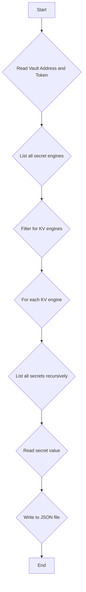

# Vault Recursive Copy

This is a CLI tool to recursively copy secrets from a Vault instance to a JSON file.

## Flowchart



## Build

To build the application, you need to have Go installed. Then, you can run the following command:

```bash
go build
```

## Usage

To use the application, you can run the following command:

```bash
./vault-recursive-copy --token <your-vault-token> --addr <your-vault-address> --output secrets.json
```

### Flags

*   `--token`: Your Vault token.
*   `--addr`: The address of your Vault instance.
*   `--output`: The output file to save the secrets to. Defaults to `secrets.json`.
